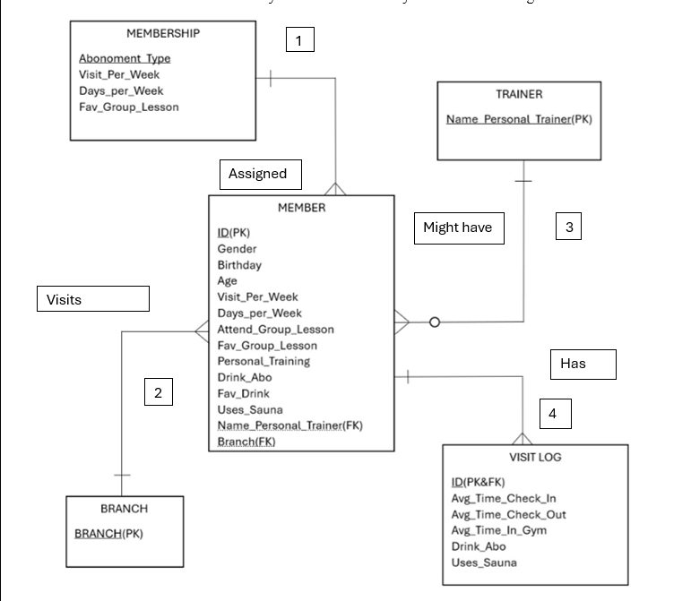

# Drexel Fitness Gym Database Design

Designed a relational database model for Drexel Fitness to replace spreadsheet tracking of members, memberships, trainers, branches, and visits. The system captures usage patterns such as check-in and check-out times, sauna usage, drink plans, and group lesson participation to enable reporting on class popularity and member engagement.

---

## ER Diagram

---

## Database Tables

- MEMBER  
- MEMBERSHIP  
- TRAINER  
- BRANCH  
- VISIT_LOG  

---

## Key Business Questions

1. Which branches have the highest participation in group lessons?
2. What are the top 3 most popular group classes?
3. What percentage of members subscribe to drink plans?

---

## Repository Structure
